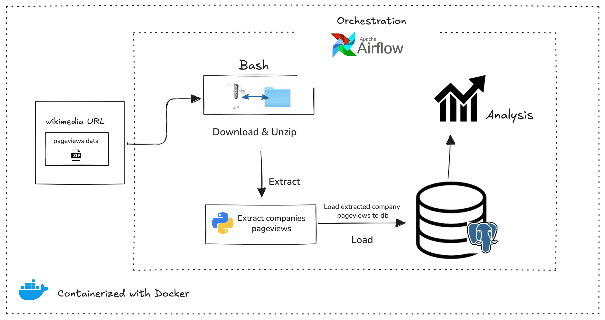

# End-to-End ETL Pipeline for Page Views Analysis

In this project, a ETL Pipeline was built that:
- Download any one hour pageviews data in October from wikimedia
- Extract pageviews for the following 5 compaanies; Amazon, Google, Apple, Microsoft, and Facebook
- Load the needed fields and pagenames into a database
- Perform a simple analysis to get the company with the highest pageviews for that hour

# Architectural Overview of the Project

The ETL pipeline consists of several key components:

1. **Data Ingestion**: The pipeline starts with downloading the pageviews data from Wikimedia for a specific hour in October. This is done using a Bash command (wget) and zipped pageviews data is downloaded. The downloaded file is then unzipped to extract the relevant data.

2. **Data Transformation**: Once the data is ingested, it is transformed to extract relevant information for the specified companies (Amazon, Google, Apple, Microsoft, and Facebook). This involves filtering the data and restructuring it as needed.

3. **Data Loading**: The transformed data is then loaded into a PostgreSQL database. This is done using SQL scripts that create the necessary tables and postgres hook to insert the data.

4. **Data Analysis**: Finally, a simple analysis is performed to determine which company had the highest pageviews during the specified hour. This involves querying the database and processing the results.

5. **Orchestration**: The entire ETL process is orchestrated using Apache Airflow, which manages the workflow and ensures that each step is executed in the correct order.

6. **Containerization**: The entire setup is containerized using Docker and Docker Compose, allowing for easy deployment and management of the Airflow environment along with the PostgreSQL database.

7. **Success/Failure Notifications**: The pipeline is configured to send email notifications upon success or failure of the ETL process, ensuring that stakeholders are informed about the pipeline's status. The company with the highest pageviews is also included in the success notification.

The architectural diagram of the ETL pipeline is given below:



# Reproducibility

To reproduce this project, follow the steps below:

1. Clone the repository to your local machine.
2. Ensure you have Docker and Docker Compose installed.
3. Navigate to the project directory. 
4. Start the Airflow services using Docker Compose:

```bash
docker-compose up -d
```

5. Access the Airflow web interface at `http://localhost:8080`.
6. Trigger the ETL pipeline.


# Project Structure

- `dags/`: Contains the Airflow DAG definition for the ETL pipeline.
- `config/`: Contains configuration files for the Airflow environment.
- `docker-compose.yml`: Docker Compose file to set up the Airflow environment.
- `requirements.txt`: List of Python dependencies for the custom docker image.
- `Dockerfile`: Dockerfile to build a custom Airflow image with necessary dependencies.
- `dags/wikipage/files`: Directory to store downloaded pageviews data.
- `dags/wikipage/include`: Directory containing Python scripts for python callable functions in DAG.
- `dags/wikipage/sql`: Directory containing SQL scripts for database operations.

